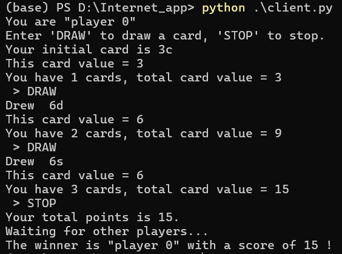
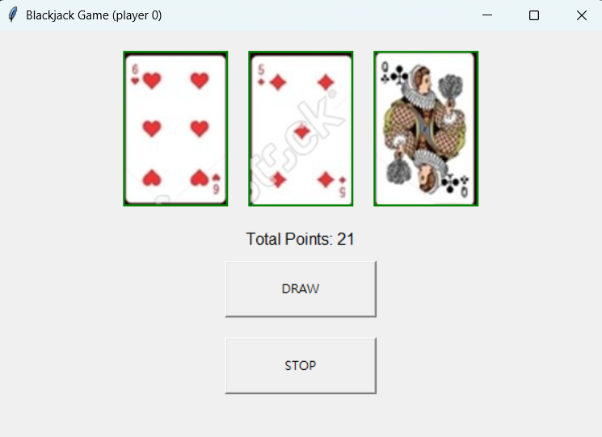

# Black Jack ♠️♥️

A multiplayer Black Jack game featuring both **CLI (Command Line Interface)** and **GUI (Graphical User Interface)** versions. This project demonstrates the implementation of **Client-Server Architecture**, **Socket Programming**, and **Multi-threading** in Python.

## 🚀 Features

* **Client-Server Architecture**: Centralized server manages game logic and player states.
* **Multi-threading**: Supports multiple players connecting and playing simultaneously.
* **Dual Interfaces**:
    * **CLI**: Lightweight text-based interface.
    * **GUI**: User-friendly graphical interface built with `tkinter`.
* **Real-time Interaction**: Instant updates for card drawing and game status broadcasting.

## 🛠️ Tech Stack

* **Language**: Python 3
* **Networking**: Python `socket` (TCP/IP)
* **Concurrency**: Python `threading`
* **GUI Framework**: `tkinter`

## 📂 Project Structure

* `server.py` / `client.py`: Source code for the CLI version.
* `server_gui.py` / `client_gui.py`: Source code for the GUI version.
* `cards/`: (Ensure your card images are in this folder if applicable for GUI)

## 📖 How to Run

### 1. Start the Server
First, initialize the server to accept connections.
```bash
# For CLI version
python server.py

# For GUI version
python server_gui.py
```

### 2. Start the Client(s)
Run the client script on different terminals or machines to join the game. Note: Please update the IP address in client.py if running on different machines.
```bash
# For CLI version
python client.py

# For GUI version
python client_gui.py
```

## 🎮 Game Rules
1. Goal: Get a hand value closest to 21 without exceeding it.
2. Card Values:
   - 2-10: Face value.
   - J, Q, K: 10 points.
   - Ace: 1 or 11 points (auto-adjusted).
3. Gameplay: Each player draws cards ("DRAW") or holds ("STOP"). Once all players stop, the server calculates and announces the winner.

## 💻 Technical Implementation
### Server Side
- Initializes via start_server() and binds to a specific IP/Port.
- Uses accept_connections() to listen for incoming players.
- Spawns a new thread (handle_client_wrapper) for each connected player to ensure non-blocking interaction.
- Manages the deck state and broadcasts the winner via announce_winner() after all players signal STOP.

### Client Side
- Connects to the server via socket.
- GUI Version:
   - Uses tkinter to render card images and buttons.
   - Sends DRAW or STOP commands to the server via send().
   - Receives card data and game results via recv() and updates the UI dynamically.

## 📸 Screenshots

### CLI Interface


### GUI Interface

  
---
**Author**: Yu-Cheng Wang
